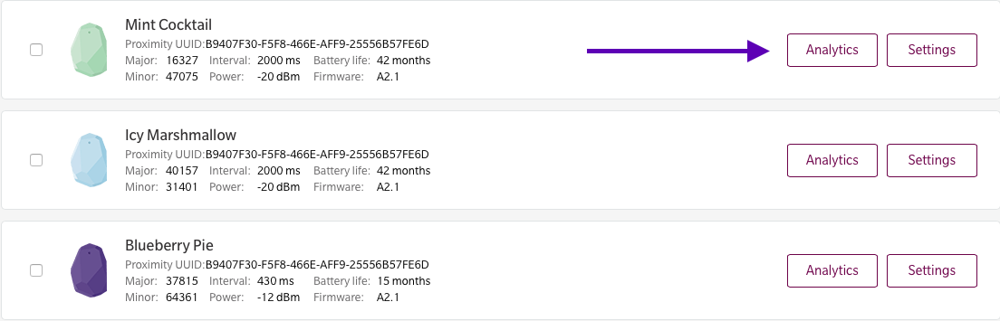

# Estimote SDK for Apple iOS

## Table of Contents

- [Installation](#installation)
- [Examples](#examples)
- [Client part technical overview](#client-part-technical-overview)
  - [Estimote Cloud API](#estimote-cloud-api)
  - [Estimote Analytics](#estimote-analytics)
  - [Trigger engine](#trigger-engine)
- [Utility part technical overview](#utility-part-technical-overview)
- [Important 3.0 migration notes](#important-30-migration-notes)
- [Changelog](#changelog)

## Introduction

We want the Estimote iOS SDK to be first choice when building any Estimote Beacons or Nearables related experience for the Apple iOS Platform. Our SDK provides a wide range of both utility and client facing features that will save time and make development easier than ever. It's built purely on Apple Core Location and Core Bluetooth technologies and is 100% iBeacon compatible.

Learn more:

- Go through our [Developer Docs](http://developer.estimote.com).
- Play with [Examples](https://github.com/Estimote/iOS-SDK/tree/master/Examples) demonstrating how to use the SDK.
- Download [Estimote iOS app](https://itunes.apple.com/us/app/estimote/id686915066?mt=8) for demos and beacon management features.
- For answers to the most common questions and app inspirations, see [Estimote Community Portal](http://community.estimote.com).
- Ask your own questions on [Estimote Community Forums](https://forums.estimote.com).
- [Comprehensive SDK reference](http://estimote.github.io/iOS-SDK/)

## Installation

Estimote SDK 3.X comes to you as a **framework** rather than a **static library + headers** like it used to. This greatly simplifies setup, as you only need to include a single *EstimoteSDK.framework* file in your project to get started:

1. Drag and drop EstimoteSDK.framework file into your Xcode project. It will automatically show up in your project navigator and will be added to *"Linked Frameworks and Libraries"* section in project settings.

2. Use `#import <EstimoteSDK/EstimoteSDK.h>` in your implementation files.

   **Note:** in Swift, you need to add `#import <EstimoteSDK/EstimoteSDK.h>` to an *Objective-C Bridging Header* instead:

   * right-click on the "Support Files" group in the navigator, and choose "New File…"
   * pick a "Header File" from the "iOS - Source" section, and save it as "ObjCBridge.h"
   * add the `#import <EstimoteSDK/EstimoteSDK.h>` line to the newly created file
   * select your project in the navigator and go to "Build Settings"
   * look for the "Objective-C Bridging Header" setting and set it to `${PROJECT_NAME}/ObjCBridge.h`

Estimote SDK is also available from [CocoaPods.org](https://cocoapods.org/pods/EstimoteSDK).

**Remember to keep the Estimote SDK updated to benefit from the latest and greatest: bug fixes, new features etc.**

## Examples

Estimote SDK contains a lot of examples and inspiration to help you get familiar with the way it can be used in your app. Alternatively, you can use the provided example apps as a basis for more sophisticated beacon management tools. Examples are completely open source and cover most important areas of beacons and nearables configuration and management.


## Client part technical overview

The SDK requires iOS 7+, as it depends on the CoreLocation's support for iBeacon first introduced in iOS 7. The feature set of this Estimote SDK is divided into two parts: **Client** and **Utility**.

**Client** part is dedicated to be used inside your publicly distributed applications featuring Estimote Beacons or Nearables integration. It helps you work with Apple iBeacon objects, adding some useful functionality like filtering, ranged object limitation or combining beacons from few regions into one callback.

There are also two interesting additions: a simulator class that allows you to speed up testing of your app using virtual beacon/nearable objects, and a helper class for Apple Watch integration. Description of most important components can be found below:

* **ESTBeaconManager** - Simple wrapper around Core Location's CLLocationManager class. It exposes API to range and monitor iBeacon devices with some additional options like sorting or filtering. It works with pure CLBeacon objects.
* **ESTSecureBeaconManager** - CLLocationManager wrapper dedicated to work with devices that are using Estimote Secure UUID mechanism. Similarily to ESTBeaconManager it allows to range and monitor secured devices as well as verify their proximity.
* **ESTEddystoneManager** - Entry point to work with Google Eddystone compatible devices. Allows to discover beacons broadcasting both Eddystone-UID and Eddystone-URL packets. You can find out more on [Estimote Developer Portal](http://developer.estimote.com/eddystone/).
* **ESTNearableManager** - Entry point to work with nearables. It allows to range and monitor stickers with given type or identifier in the similar manner to how it's done with iBeacon.
* **ESTSimulatedNearableManager** - Analogously to ESTSimulatedBeaconManager it lets you generate fake ranging and monitoring events for nearables. You can see example implementation of this class in [Estimote WatchKit SDK](https://github.com/Estimote/Estimote-WatchKit-SDK).
* **ESTNotificationTransporter** - Class allowing you to easily exchange iBeacon and Nearable data, gathered from events like ranging or monitoring, between your host app and Apple Watch / other iOS 8 Extension. For more details, check the [Estimote WatchKit SDK](https://github.com/Estimote/Estimote-WatchKit-SDK).

#### Estimote Cloud API

Estimote Cloud API can be easily accessed using set of request objects available in Estimote SDK. Requests are using NSURLConnection based framework and can be invoked with completion blocks. Available requests should be used instead of **ESTCloudManager** class that is deprecated starting from Estimote SDK version 3.5.0. Usage of Estimote Cloud related requests should be preceded by API configuration using **ESTConfig** class. It allows to authorize user based on AppID and AppToken available in Estimote Cloud / Apps tab. We recommend to configure API in AppDelegate class of your App using code like this:

```
- (BOOL)application:(UIApplication *)application didFinishLaunchingWithOptions:(NSDictionary *)launchOptions
{
    // App ID and App Token should be provided using method below
    // to allow beacons connection and Estimote Cloud requests possible.
    // Both values can be found in Estimote Cloud ( http://cloud.estimote.com )
    // in Account Settings tab.

    [ESTConfig setupAppID:nil andAppToken:nil];

    // Estimote Analytics allows you to log activity related to monitoring mechanism.
    // At the current stage it is possible to log all enter/exit events when monitoring
    // Particular beacons (Proximity UUID, Major, Minor values needs to be provided).

    [ESTConfig enableMonitoringAnalytics:YES];
    [ESTConfig enableRangingAnalytics:NO];
    [ESTConfig enableGPSPositioningForAnalytics:NO];


    self.window = [[UIWindow alloc] initWithFrame:[[UIScreen mainScreen] bounds]];

    return YES;
}
```
Following requests are available:

* **ESTRequestGetBeacons** - Request allows to fetch all beacons assigned to authorized user account.
* **ESTRequestBeaconMac** - Request allows to fetch MAC address of beacon based on it's CLBeacon representation.
* **ESTRequestBeaconColor** - Request allows to fetch color of beacon based on MAC address or CLBeacon representation.
* **ESTRequestBeaconDetails** - Request allows to fetch all information about beacon including its current settings.
* **ESTRequestGetNearables** - Request allows to fetch all nearables assigned to authorized user account.
* **ESTRequestGetPendingSettings** - Request allows to fetch all pending settings for authorized user beacons. Request is a part of Estimote Remote Fleet Management mechanism.
* **ESTRequestRegisterDevice** - Request allows register device in Estimote Cloud to receive APN based notifications about new pending changes. Request is a part of Estimote Remote Fleet Management mechanism.

Sample request invocation looks like this:


```
// Get list of beacons from the Estimote Cloud
ESTRequestGetBeacons *request = [[ESTRequestGetBeacons alloc] init];

[request sendRequestWithCompletion:^(NSArray *beaconVOs, NSError *error) {

  // Handle response from the Estimote Cloud here ...
  [self.tableView reloadData];
}];
```

Requests are using simple retain cycle based mechanism. They are not deallocated until completion block is returned. Self reference should be kept somewhere in the block body thought.

#### Estimote Analytics

Estimote platform allows you to collect analytics information about your beacons usage. Setup of Estimote Analytics is very easy. Enabling feature using `ESTConfig` class methods automatically sents events to Estimote Cloud . No additional code is required.

Developer decides what kind of analytics data collect. Ranging, Monitoring or both can be tracked. GPS position of device can be collected optionally. Start using Estimote analytics by placing following code in `application:didFinishLaunchingWithOptions:` method of AppDelegate class:
```
- (BOOL)application:(UIApplication *)application didFinishLaunchingWithOptions:(NSDictionary *)launchOptions
{
    // ESTAppDelegate: APP ID and APP TOKEN are required
    // to collect Analytics data.
    [ESTConfig setupAppID:nil andAppToken:nil];

    // To enable Estimote Cloud Analytics just pass YES
    [ESTConfig enableMonitoringAnalytics:NO];
    [ESTConfig enableRangingAnalytics:NO];

    // You can optionally collect GPS location
    [ESTConfig enableGPSPositioningForAnalytics:NO];
}
```

**IMPORTANT!** Please note that Estimote Analytics works only with Proximity UUID identifiers different then default one (*B9407F30-F5F8-466E-AFF9-25556B57FE6D*). Please change it before using this feature.



Collected analytics data can be easily access in Estimote Cloud (http://cloud.estimote.com) for each beacon individually. Navigate to **Beacons** section and press **Analytics** button next to the beacon you are interested in.

#### Trigger engine

On top of basic ranging and monitoring functionality delivered by classes mentioned above you can also use a higher level **Estimote Trigger engine**. It provides abstraction that simplifies building complex rules describing circumstances that should trigger some action. Sample conditions can be described like this: *"Let me know when I'm next to my moving bike nearable, after 5pm, and when temperature is lower than 15 degrees C."*.

Estimote Trigger engine provides basic rules (ESTRule) related to Estimote nearables and time events. It was created in a way that makes it easy to extend default rules so you can easily build custom rules that suit your needs. Most important classes you will want to use are:

* **ESTTriggerManager** - Entry point for trigger engine mechanism. Its main responsibility is to manage all defined rules and inform you when provided conditions are satisfied.
* **ESTRule** - Base implementation of a rule. All predefined classes like ESTTemperatureRule or ESTMotionRule are based on it and you should also use it to build your own custom rules.
* **ESTTrigger** - Class that allows you to describe context based on a set of rules.

In the typical workflow you will wrap your rules in ESTTrigger object and pass it to ESTTriggerManager.

## Utility part technical overview

**Utility** was created to support apps that manage Estimote Beacons and Nearables. It provides beacon connectivity and configuration methods, so you can easily change settings like Proximity UUID, Major, Minor, Power Modes and much more. It also allows you to easily perform Over The Air firmware update. It works mainly with Core Bluetooth framework. Main classes you are going to use are:

* **ESTUtilityManager** - Allows to discover devices using Core Bluetooth. Discovered device identifier can then be used to connect and configure the device.
* **ESTBeaconConnection** - Manages connection and configuration of a particular device. Allows to both read and write all the settings.Allows to perform Over The Air firmware update of an Estimote Beacon.

Another valuable component is the **Bulk Updater** mechanism, which lets you update settings of multiple devices in batches. It's compatible with **Remote Management** feature using Estimote Cloud, so you can define a set of new settings both locally or remotely. After new settings are defined and synced with Estimote Cloud, the updates will be performed using all iOS running devices that are connected to the particular Estimote Account.

## Important 3.0 migration notes

Estimote SDK has been with us for more than a year now. Thanks to feedback from our developer community, we’ve learned a lot about how it helps developers to reach their goals. However we also learned some of its shortcomings. As we want to deliver the best developer experience we decided to restructure our SDK and introduce some backward incompatible changes which will ultimately make it much easier to develop using our stack.

This update comes with firmware update to version 3.0.1. This version changes the way authorization is handled during device connection. It also introduces a new feature we call “conditional broadcasting”, which allows you to restrict broadcasting based on a beacon’s orientation and movement. Now you can enable one of the two new modes of beacon operation:

* *“Flip to Sleep”* — in this mode, the beacon will not broadcast advertising packets when placed on its back (gecko pad facing up).
* *“Motion only”* — in this mode, the beacon will only broadcast advertising packets when it's moving.

There are two main motivations behind this feature - firstly, it makes it much easier to test beacon enabled apps, as both of these modes provide a virtual “off” switch for your beacons. Secondly, we’re always looking for ways to save battery life, and both the new broadcasting modes, in particular “motion only” advertising offer innovative ways to save beacon power in some specific use cases.

**Please note that Estimote beacon firmware 3.0.1 is not backward compatible! This means you won't be able to perform connection using 2.4.0 Estimote SDK and 2.12 AppStore app to updated devices.**

We've also started [discusion about Estimote SDK 3.0.0](https://forums.estimote.com/t/sdk-3-0-beta-discussion/78) using our recently announced Estimote Forums. Feel free to participate and give us your feedback!

If you already use Estimote SDK we've provided [Migration Guide](SDK_3_0_MIGRATION_GUIDE.md) to make it easier for you to update.

## Changelog

To see what has changed in recent versions of Estimote SDK, see the [CHANGELOG](https://github.com/Estimote/iOS-SDK/blob/master/CHANGELOG.md).
