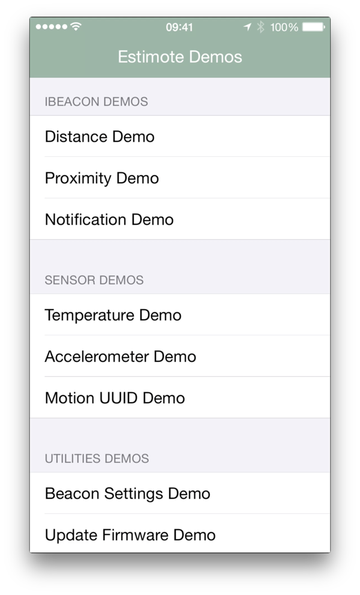
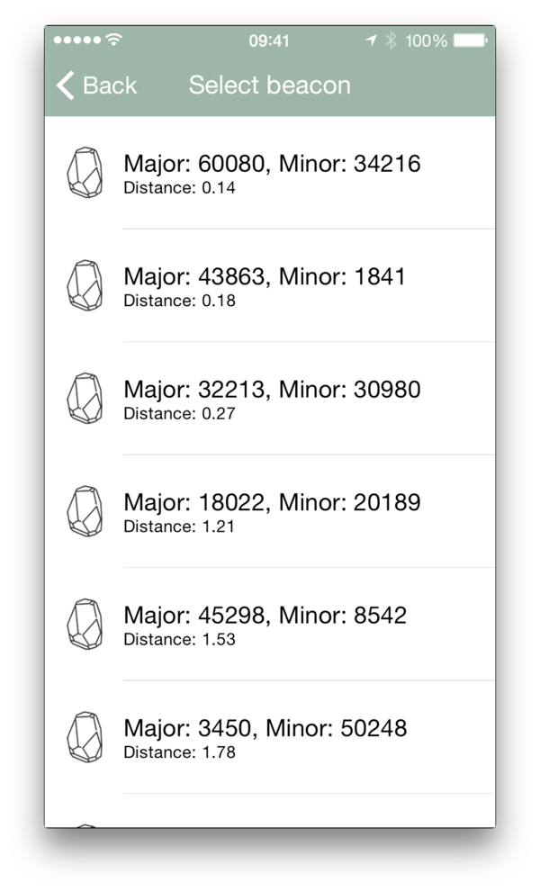
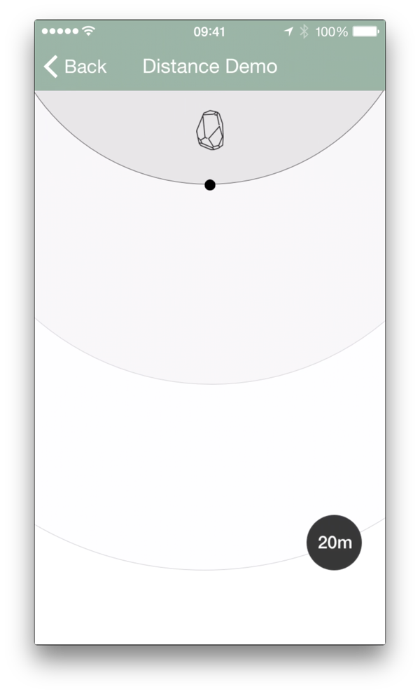
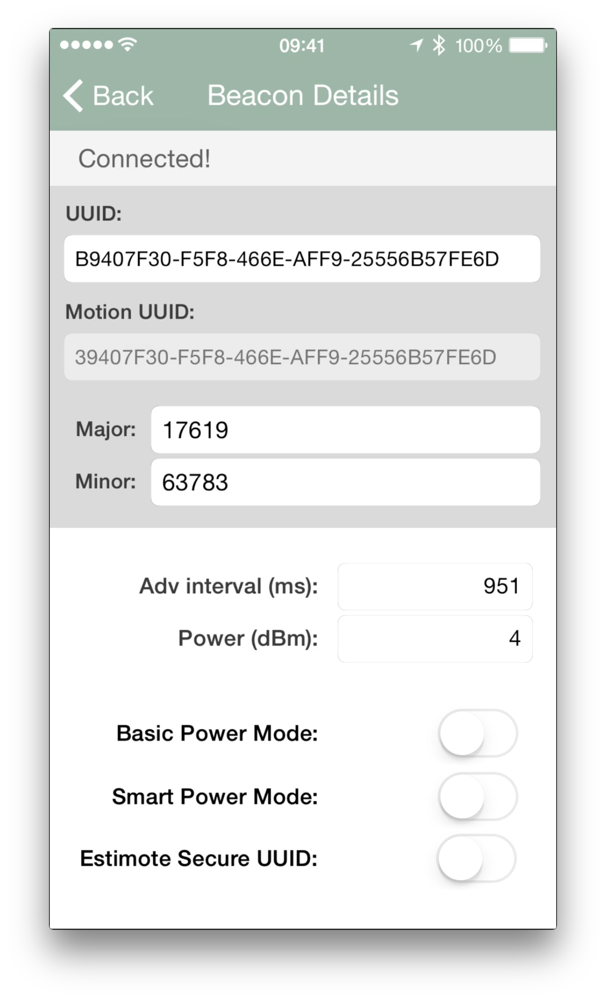
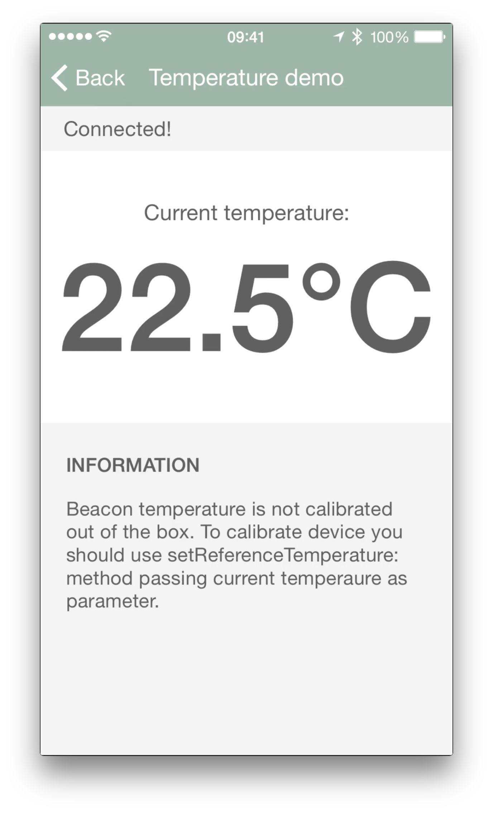
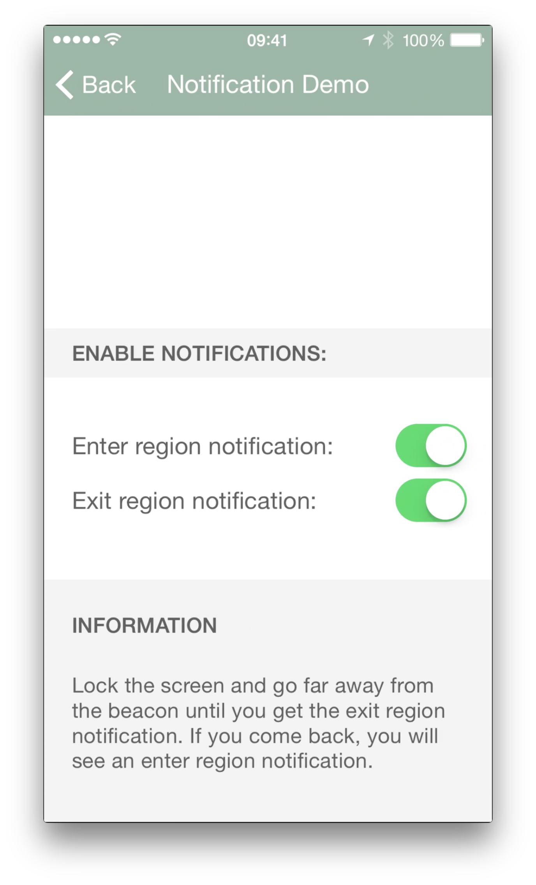

# Estimote SDK for Apple iOS

## IMPORTANT RELEASE NOTE!

Estimote SDK has been with us for more than a year now. Thanks to feedback from our developer community, we’ve learned a lot about how it helps developers to reach their goals. However we also learned some of its shortcomings. As we want to deliver the best developer experience we decided to restructure our SDK and introduce some backward incompatible changes which will ultimately make it much easier to develop using our stack. 

This update comes with firmware update to version 3.0.1. This version changes the way authorization is handled during device connection. It also introduces a new feature we call “conditional broadcasting”, which allows you to restrict broadcasting based on a beacon’s orientation and movement. Now you can enable one of the two new modes of beacon operation:

* *“Flip to Sleep”* — in this mode, the beacon will not broadcast advertising packets when placed on its back (gecko pad facing up).
* *“Motion only”* — in this mode, the beacon will only broadcast advertising packets when it's moving.

There are two main motivations behind this feature - firstly, it makes it much easier to test beacon enabled apps, as both of these modes provide a virtual “off” switch for your beacons. Secondly, we’re always looking for ways to save battery life, and both the new broadcasting modes, in particular “motion only” advertising offer innovative ways to save beacon power in some specific use cases.

**Please note that Estimote beacon firmware 3.0.1 is not backward compatible! This means you won't be able to perform connection using 2.4.0 Estimote SDK and 2.12 AppStore app to updated devices.**

We've also started [discusion about Estimote SDK 3.0.0](https://forums.estimote.com/t/sdk-3-0-beta-discussion/78) using our recently announced Estimote Forums. Feel free to participate and give us your feedback!

If you already use Estimote SDK we've provided [Migration Guide](SDK_3_0_MIGRATION_GUIDE.md) to make it easier for you to update.

## Table of Contents

<!-- START doctoc -->

- [Introduction](#introduction)
- [Installation](#installation)
- [Examples](#examples)
- [Technical overview](#technical-overview)
  - [Client](#client)
    - [Trigger engine](#trigger-engine)
  - [Utility](#utility)
- [Changelog](#changelog)

<!-- END doctoc -->

## Introduction

We want the Estimote iOS SDK to be first choice when building any Estimote Beacons or Nearables related experience for the Apple iOS Platform. Our SDK provides a wide range of both utility and client facing features that will save time and make development easier than ever. It's built purely on Apple Core Location and Core Bluetooth technologies and is 100% iBeacon compatible.

In addition to the Estimote SDK we've included a lot of examples to show you how to use our SDK in real scenarios. You should also check our utility app that can be found in AppStore: [Estimote iOS app](https://itunes.apple.com/en/app/estimote/id686915066?mt=8).

To learn more, read the [API section on our website](http://estimote.com/api/index.html#). You can review the [SDK documentation](http://estimote.github.io/iOS-SDK/) and check our [Community Portal](http://community.estimote.com) to get the answers for the most common questions related to iBeacon in general as well as to questions about Estimote specific hardware and software.

## Installation

Estimote SDK 3.0 comes to you as a **framework** rather than a **static library + headers** like it used to. This greatly simplifies setup, as you only need to include a single *EstimoteSDK.framework* file in your project to get started:

1. Drag and drop EstimoteSDK.framework file into your Xcode project. It will automatically show up in your project navigator and will be added to *"Linked Frameworks and Libraries"* section in project settings. 

2. Estimote SDK depends on Apple's CoreLocation and CoreBlueooth frameworks as well as SystemConfiguration framework to handle Estimote Cloud API requests, so you should include them in your project too. When you add them to your project settings, it should look like on the screenshot below.

3. That's it, congratulations and happy hacking!

## Examples

Estimote SDK contains a lot of examples and inspiration to help you get familiar with the way it can be used in your app. Alternatively, you can use the provided example apps as a basis for more sophisticated beacon management tools. Examples are completely open source and cover most important areas of beacons and nearables configuration and management.

## Technical overview

The SDK requires iOS 7+, as it depends on the CoreLocation's support for iBeacon first introduced in iOS 7. The feature set of this Estimote SDK is divided into two parts: *Client* and *Utility*.

### Client

**Client** part is dedicated to be used inside your publicly distributed applications featuring Estimote Beacons or Nearables integration. It helps you work with Apple iBeacon objects, adding some useful functionality like filtering, ranged object limitation or combining beacons from few regions into one callback.

There are also two interesting additions: a simulator class that allows you to speed up testing of your app using virtual beacon/nearable objects, and a helper class for Apple Watch integration. Description of most important components can be found below:

* **ESTBeaconManager** - Simple wrapper around Core Location's CLLocationManager class. It exposes API to range and monitor iBeacon devices with some additional options like sorting or filtering. It works with pure CLBeacon objects.
* **ESTSecureBeaconManager** - CLLocationManager wrapper dedicated to work with devices that are using Estimote Secure UUID mechanism. Similarily to ESTBeaconManager it allows to range and monitor secured devices as well as verify their proximity.
* **ESTSimulatedBeaconManager** - Creates virtual beacon instances to use in Xcode iOS Simulator. It lets you dispatch fake beacon events related to iBeacon ranging and monitoring.
* **ESTNearableManager** - Entry point to work with nearables. It allows to range and monitor stickers with given type or identifier in the similar manner to how it's done with iBeacon.
* **ESTSimulatedNearableManager** - Analogously to ESTSimulatedBeaconManager it lets you generate fake ranging and monitoring events for nearables. You can see example implementation of this class in [Estimote WatchKit SDK](https://github.com/Estimote/Estimote-WatchKit-SDK).
* **ESTNotificationTransporter** - Class allowing you to easily exchange iBeacon and Nearable data, gathered from events like ranging or monitoring, between your host app and Apple Watch / other iOS 8 Extension. For more details, check the [Estimote WatchKit SDK](https://github.com/Estimote/Estimote-WatchKit-SDK).

#### Trigger engine

On top of basic ranging and monitoring functionality delivered by classes mentioned above you can also use a higher level **Estimote Trigger engine**. It provides abstraction that simplifies building complex rules describing circumstances that should trigger some action. Sample conditions can be described like this: *"Let me know when I'm next to my moving bike nearable, after 5pm, and when temperature is lower than 15 degrees C."*.

Estimote Trigger engine provides basic rules (ESTRule) related to Estimote nearables and time events. It was created in a way that makes it easy to extend default rules so you can easily build custom rules that suit your needs. Most important classes you will want to use are:

* **ESTTriggerManager** - Entry point for trigger engine mechanism. Its main responsibility is to manage all defined rules and inform you when provided conditions are satisfied.
* **ESTRule** - Base implementation of a rule. All predefined classes like ESTTemperatureRule or ESTMotionRule are based on it and you should also use it to build your own custom rules.
* **ESTTrigger** - Class that allows you to describe context based on a set of rules.

In the typical workflow you will wrap your rules in ESTTrigger object and pass it to ESTTriggerManager.

### Utility

**Utility** was created to support apps that manage Estimote Beacons and Nearables. It provides beacon connectivity and configuration methods, so you can easily change settings like Proximity UUID, Major, Minor, Power Modes and much more. It also allows you to easily perform Over The Air firmware update. It works mainly with Core Bluetooth framework. Main classes you are going to use are:

* **ESTUtilityManager** - Allows to discover devices using Core Bluetooth. Discovered device identifier can then be used to connect and configure the device.
* **ESTBeaconConnection** - Manages connection and configuration of a particular device. Allows to both read and write all the settings.
* **ESTBeaconFirmwareUpdate** - Needed to perform Over The Air firmware update of an Estimote Beacon.

Another valuable component is the **Bulk Updater** mechanism, which lets you update settings of multiple devices in batches. It's compatible with **Remote Management** feature based on Estimote Cloud, so you can define a set of new settings both locally or remotely. After new settings are defined and synced with Estimote Cloud, the updates will be performed using all iOS running devices that are connected to the particular Estimote Account.

## Changelog

To see what has changed in recent versions of Estimote SDK, see the [CHANGELOG](https://github.com/Estimote/iOS-SDK/blob/master/CHANGELOG.md).
